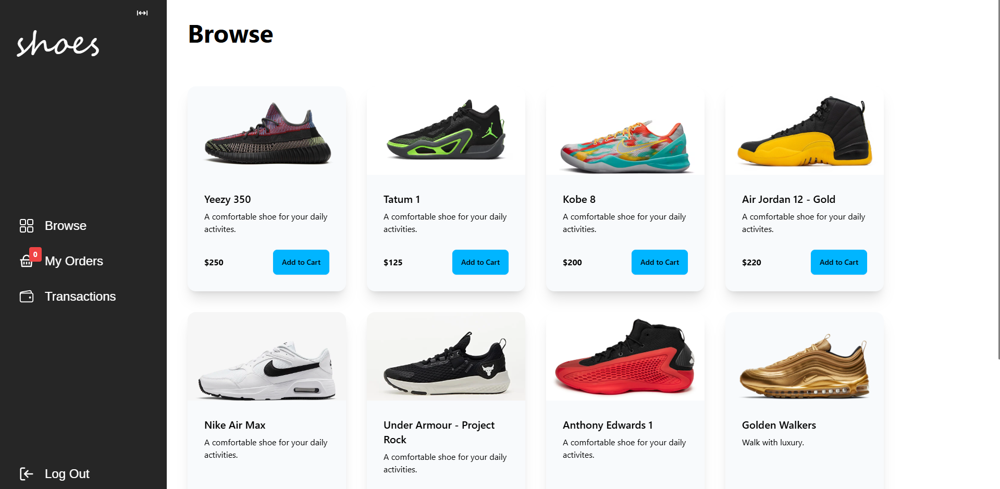

# shoes

## Overview
This project is about a shoe apparel website where users can buy shoes.

## Video
Check out a video of the website [here](https://youtu.be/L-ozkeF6E_8).

## Screenshots


## Description
Due to limitations, if you want to view the website, then you have to build
the website locally using the docker config files: dockerfile and
docker-compose.yaml. The address of the website when run locally is just
```localhost:5173```. Check out the docker-compose file for more details on
accessing the backend and the database browser.

This website was made with React and ExpressJS.

## Setup
Download or copy the files for this repository. Make sure you have Docker
installed otherwise you will have to run each service manually. Build the
website by executing the command ```docker-compose build``` then
```docker-compose up```. Delete unwanted loose containers or cache by executing
the command ```docker system prune --all --volumes```.

## Notes
For the BEST viewing experience, I recommend viewing the website on a device
with at least 1024px screen size. For an optimal viewing experience, you want
a device screen size of at least 375px.

View ```info.txt``` to fix any troubleshooting errors that may occur.

## Contents
- ```README.md```: description of this repository
- ```.gitignore```: ignores unwanted files (garbage collection)
- ```.dockerignore```: ignores unwanted files for the container
- ```client```: contains files to style the website (React)
- ```server```: contains files to maintain the website (ExpressJS)
- ```docker-compose.yaml```: runs all services to build the website
- ```prisma```: contains schemas for user information
- ```postgres```: contains database files.
- ```info```: contains notes about the repository

## Contributions
Tools

- WSL2 (Ubuntu 24.04.1)
- Vim + coc.nvim
- Docker Desktop
- React + Vite
- ExpressJS
- Prisma ORM
- PostgreSQL + pgadmin4
- Stripe API

<br>

Assets

Since assets are constantly being updated, please refer to the ```assets```
folder to find out more.

## Changelog
- Website Version 1.0 established on February 2025

## License
Established on February 2025 by MIKNSJ.
